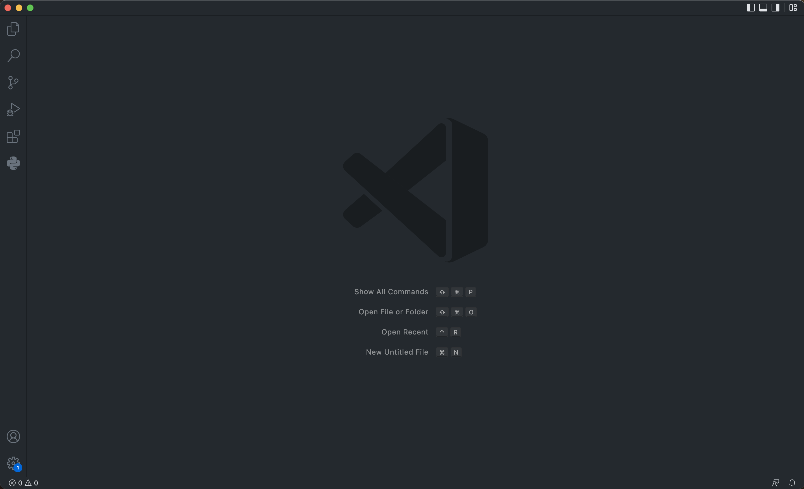
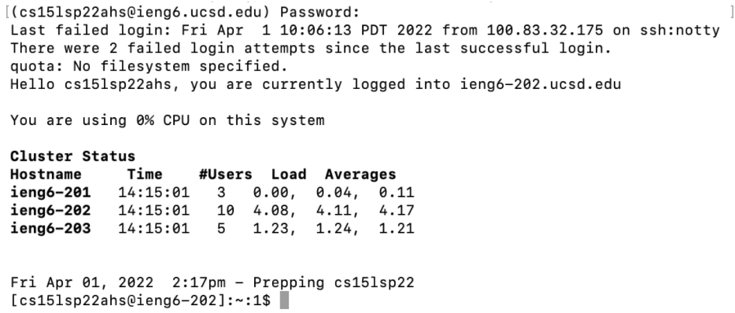
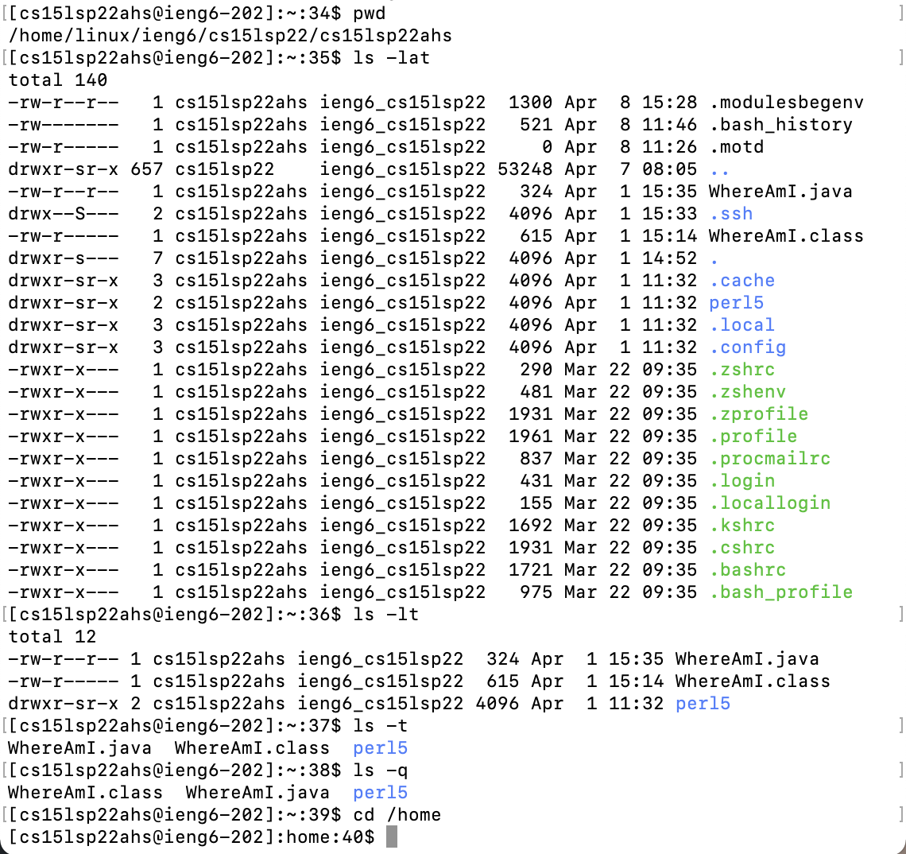
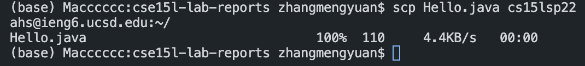
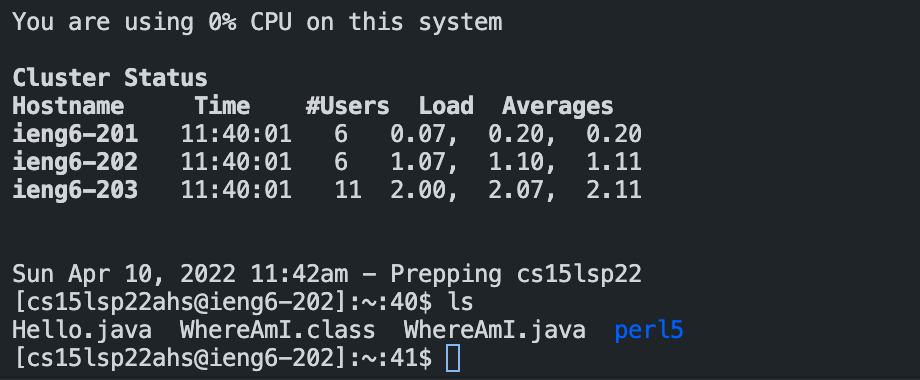
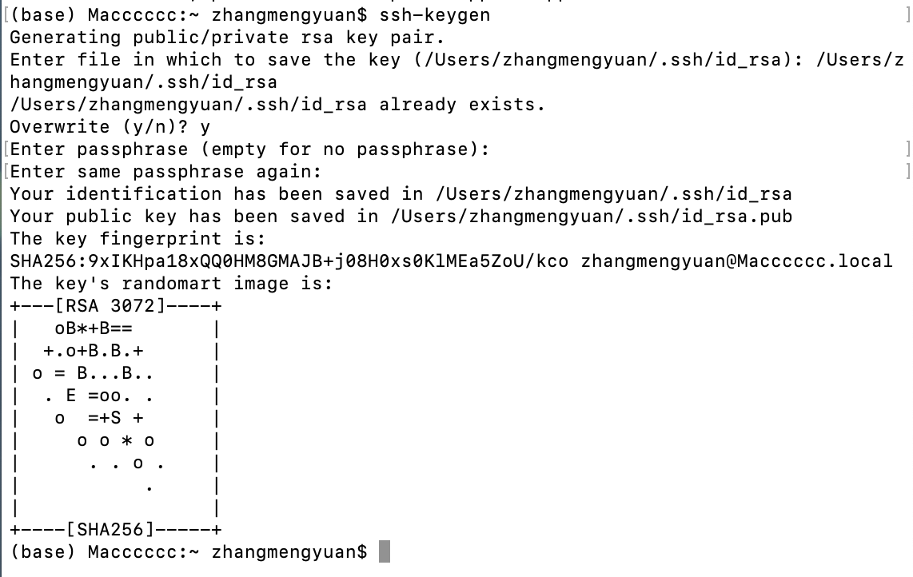
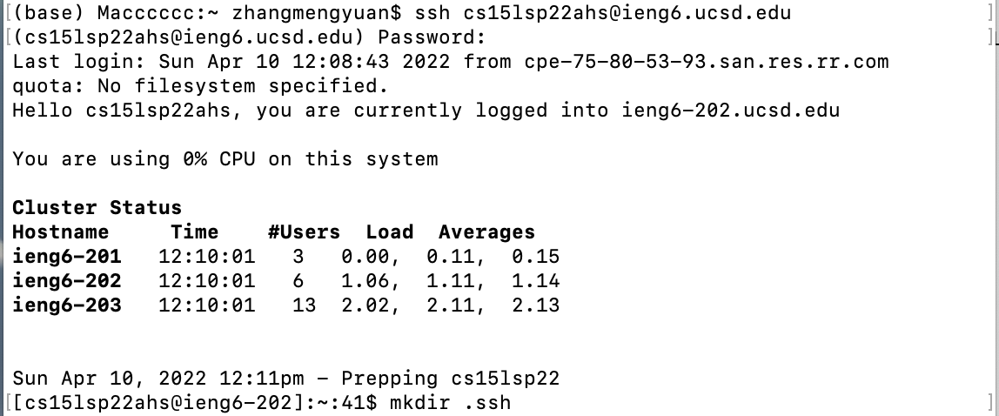
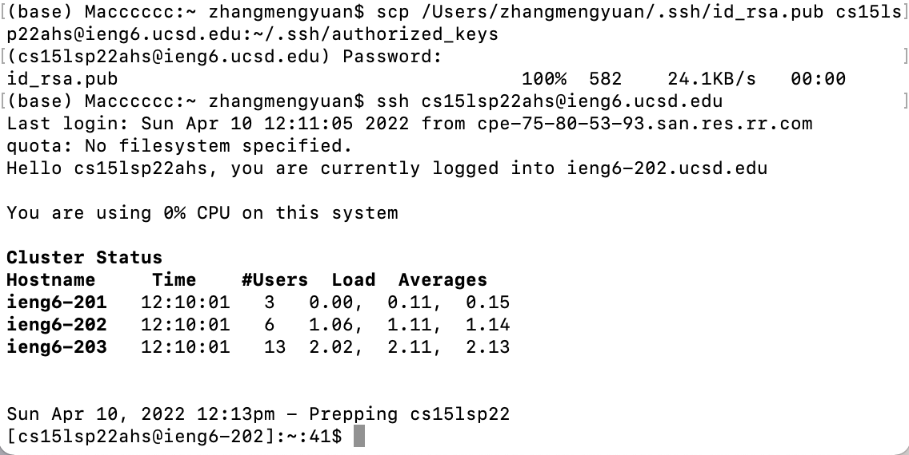
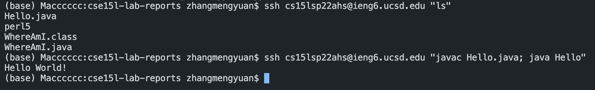

# Lab Report 1

**This lab will help you to access the remote server.**

## 1. Installing VScode

We can download the *VScode* from the [website](https://code.visualstudio.com/), you can choose the correct version for your computer. For example, my computer is a Mac, then I choose the version for macOS. 

When you open the VScode, it should look like the picture below.




## 2. Remotely Connecting

We need to open the terminal in VScode, then command `$ ssh cs15lsp22(the letters in your course-specific account)@ieng6.ucsd.edu`

The first time you log in will ask your “Are you sure you want to continue connecting”, you should choose yes. Then you need to put in your password. If you are successfully logged in, your terminal will look like the following picture.



*Make sure look up and change the password for your course-specific account for CSE15L [here](https://sdacs.ucsd.edu/~icc/index.php)*

## 3. Trying Some Commands

- `$ pwd` will print out the working directory
- `$ ls -lat` will list all time
- `$ ls -lt` will list time
- `$ ls -t` will show the last edited file
- `$ ls -a` will list all files
- `$ cd` will change the directory



*I just try some of the commands, you can try more. Here is [chect sheet](https://www.git-tower.com/blog/command-line-cheat-sheet/)*

## 4. Moving Files with `scp`

Now we want to copy the file from your computer to the remote computer.

You can create a `Hello.java` in your computer:
```
class Hello {
    public static void main(String[] args) {
        System.out.println("Hello World!");
    }
}
```
Then in the terminal from the directory where you made this file, run this command `scp Hello.java cs15lsp22(the letters in your course-specific account)@ieng6.ucsd.edu:~/`



After that, relog into your ieng6 with ssh again. Using `ls` command, you can see there is `Hello.java` appear.



## 5. Setting an SSH Key

We can use the ssh key to help we save the time when copying the local file to remote server.
On your local terminal, run this command 

`$ ssh-keygen`

`Enter file in which to save the key (/Users/<user-name>/.ssh/id_rsa): /Users/<user-name>/.ssh/id_rsa`

`Enter passphrase (empty for no passphrase):`

**Make sure you don't enter anything for this step.**

*If you’re on Windows, follow the extra ssh-add steps [here](https://docs.microsoft.com/en-us/windows-server/administration/openssh/openssh_keymanagement#user-key-generation)*



Then we need to copy the public (not the private) key to the **.ssh** directory of your user account on the server.

```
$ ssh cs15lsp22(the letters in your course-specific account)@ieng6.ucsd.edu
<Enter Password>
$ mkdir .ssh
$ <logout>
```


```
$ scp /Users/<user-name>/.ssh/id_rsa.pub cs15lsp22(the letters in your course-specific account)@ieng6.ucsd.edu:~/.ssh/authorized_keys
<Enter Password>
```


After that, you are able to log in ieng6 without password.

## 6. Optimizing Remote Running

When we want to log in and list the home directory on the remote server, we need to
```
$ ssh cs15lsp22(the letters in your course-specific account)@ieng6.ucsd.edu
$ <enter password>
$ ls
```
There is more time saving way, you can write a command in quotes at the end of an ssh command to directly run it on the remote server, then exit.
```
$ ssh cs15lsp22(the letters in your course-specific account)@ieng6.ucsd.edu "ls"
```

You also can use this way to complie and run a code
```
$ ssh cs15lsp22(the letters in your course-specific account)@ieng6.ucsd.edu "javac Hello.java; java Hello"
```


