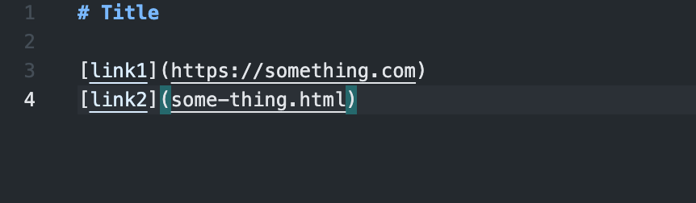
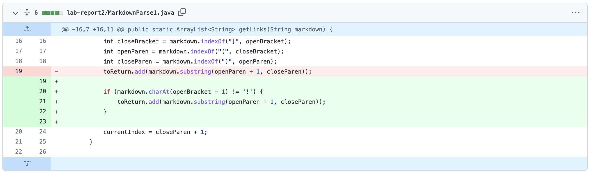
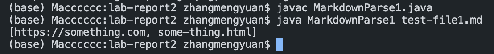

# Lab Report 2
**This lab will help you with the debugging.**

## 1. Error 1
You can download the test file [here](https://github.com/Meng-zmy/cse15l-lab-reports/blob/1557d6dd6053e678865c2efaba30832bdc7d7d9c/lab-report2/test-file1.md)

*This is the test file I have now:*
```
# Title

[link1](https://something.com)

[link2](some-thing.html)
```

**Symptom:** By using this test file, the result I get is incorrect. We want to have only the address of the link, but it also print out the address of the image. Since the image format is ``, it also contain `[]()`.


To solve this error, we need to deal with the `!`. Since the only differece between image format and link format is `!`.

So, I add a if statement to check the character before the `[` whether is `!` or not. If it is `!`, it will not add the address to the *toRetrun*; otherwise, if it is not `!`, it will add the address to the *toRetrun*.

Here is the code change for my `MarkdownParse1.java`.



After I change my `MarkdownParse1.java`, the result I get is correct.




## 2. Error 2
You can download the test file [here](https://github.com/Meng-zmy/cse15l-lab-reports/blob/1557d6dd6053e678865c2efaba30832bdc7d7d9c/lab-report2/test-file1.md)

*This is the test file I have now:*
```
# Title

[link1](https://something.com)

[link2](some-thing.html)
```

**Symptom:** By using this test file, the result I get is incorrect. We want to have only the address of the link, but it also print out the address of the image. Since the image format is ``, it also contain `[]()`.


To solve this error, we need to deal with the `!`. Since the only differece between image format and link format is `!`.

So, I add a if statement to check the character before the `[` whether is `!` or not. If it is `!`, it will not add the address to the *toRetrun*; otherwise, if it is not `!`, it will add the address to the *toRetrun*.

Here is the code change for my `MarkdownParse1.java`.


After I change my `MarkdownParse1.java`, the result I get is correct.


## 3. Error 3


