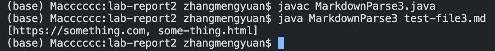
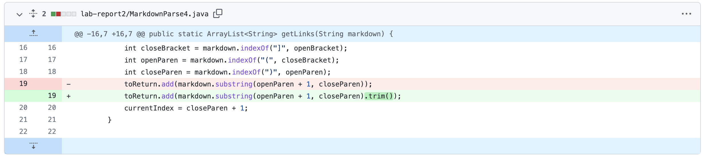

# Lab Report 2
**This lab will help you with the debugging.**

## 1. Error 1
You can download the test file [here](https://github.com/Meng-zmy/cse15l-lab-reports/blob/1557d6dd6053e678865c2efaba30832bdc7d7d9c/lab-report2/test-file1.md)

*This is the test file I have now:*
```
# Title

[link1](https://something.com)

[link2](some-thing.html)
```

**Symptom:** By using this test file, the result I get is incorrect. We want to have only the address of the link, but it also print out the address of the image. Since the image format is ``, it also contain `[]()`.


To solve this error, we need to deal with the `!`. Since the only differece between image format and link format is `!`.

So, I add a if statement to check the character before the `[` whether is `!` or not. If it is `!`, it will not add the address to the *toRetrun*; otherwise, if it is not `!`, it will add the address to the *toRetrun*.

Here is the code change for my `MarkdownParse1.java`.


After I change my `MarkdownParse1.java`, the result I get is correct.


## 2. Error 2
You can download the test file [here](https://github.com/Meng-zmy/cse15l-lab-reports/blob/c4a32b11d23344a9e96b63751c254031fb33f21f/lab-report2/test-file2.md)

*This is the test file I have now:*
```
# Title

[link1](https://something.com)
[link2](some-thing.html)

hshshshshhshshshshshshshshh
```

**Symptom:** By using this test file, it raise an OutOfMemoryError. Since there is no `[]()` can be find in last two line of the test file, the *currentIndex* will not be update, and our while loop will go infinite times until out of memory.


To solve this error, we need to deal with the situation that has no more `[]()` at the end.

So, I add a if statement to check after every link format `[]()` is there any more `[` after the *currentIndex* (Since the link format is begin with `[`). If there is no `[` after the *currentIndex*, we directly break the while loop and return the *toReturn*; otherwise, continue the while loop to find other link.

Here is the code change for my `MarkdownParse2.java`.


After I change my `MarkdownParse2.java`, the result I get is correct.


## 3. Error 3
You can download the test file [here](https://github.com/Meng-zmy/cse15l-lab-reports/blob/a89bee1cf9a2d215a537cd5503ebdbcde3f2fc0a/lab-report2/test-file3.md)

*This is the test file I have now:*
```
# Title

[link1](https://something.com)
[link3](not valid link!)
[link2](some-thing.html)
```

**Symptom:** By using this test file, the result is incorrect. It contains the non link in the result.


To solve this error, we need to check whether there is space in `()` or not. Since the valid link cannot have the whitespace in it.

So, I just add a if statement by using string method `.contains(" ")` which can check string have whitespace or not. If it not contains whitespace, it will be add to *toReturn*; otherwise, it will not be added.

Here is the code change for my `MarkdownParse3.java`.


After I change my `MarkdownParse3.java`, the result I get is correct.




## 4. Error 4
You can download the test file [here](https://github.com/Meng-zmy/cse15l-lab-reports/blob/926ee795218958d97f492ad13ee99df030d9562c/lab-report2/test-file4.md)

*This is the test file I have now:*
```
# Title

[link1](https://something.com)
[link3](    https://some.com    )
[link2](some-thing.html)
```

**Symptom:** By using this test file, the result is incorrect. It contains the space before and after the link. Since it only check the position of `(` and `)`, then add the string between `()`, it may have the extra space.


To solve this error, we need to deal with extra space in the `()`.

So, I just use a string method `.trim()` which can remove the whitespace for the string. After using this method when we add the string to *toReturn*, it will not have the extra space.

Here is the code change for my `MarkdownParse3.java`.



After I change my `MarkdownParse3.java`, the result I get is correct.


---
*I just add one more error to avoid if there is one of them will not count as error :)*