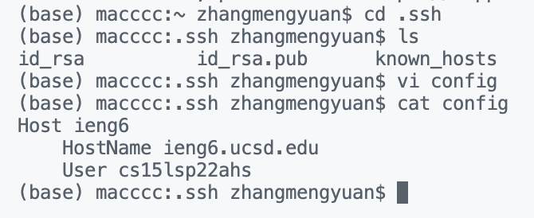
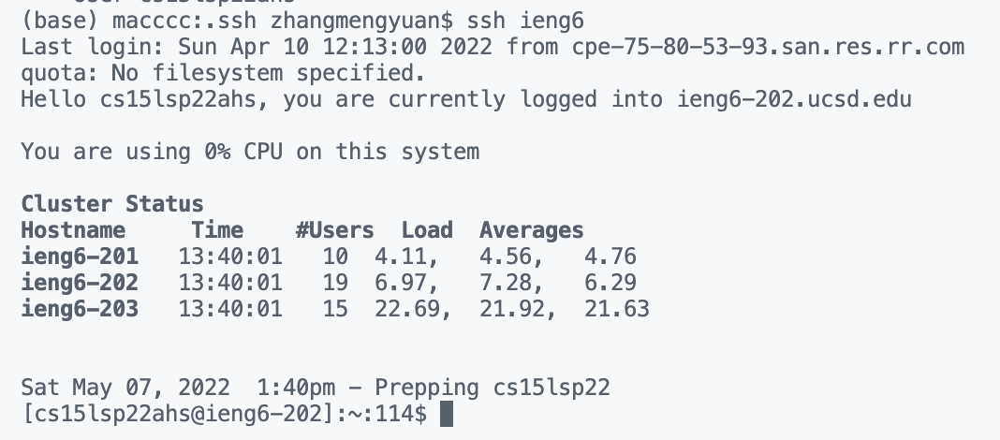
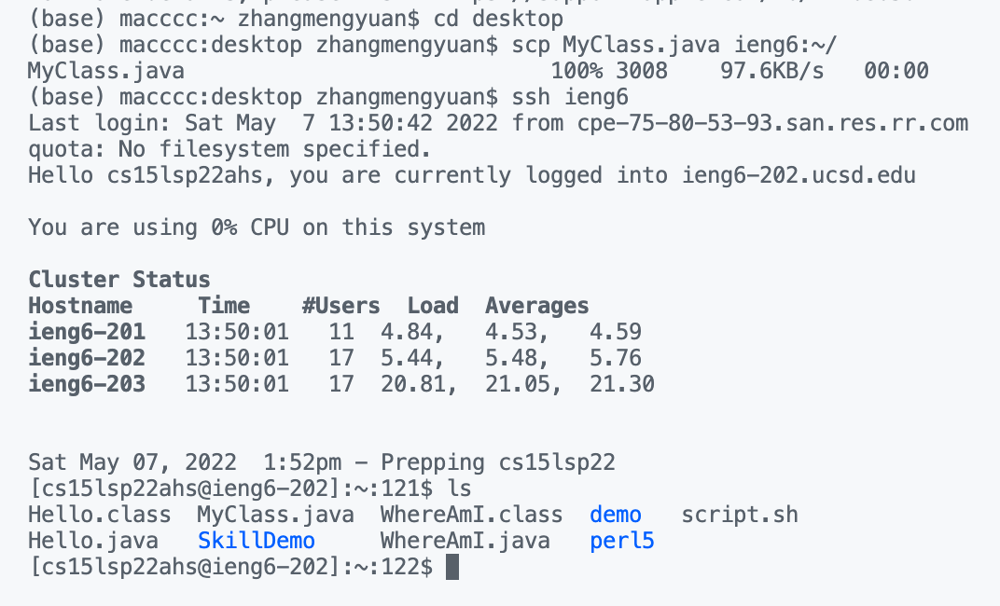

# Lab Report 3

## 1. Streamlining ssh Configuration

The way using `$ ssh cs15lsp22zzz@ieng6.ucsd.edu` log into `ieng6` is lot to type and remember. The easy way to do it is using ssh configuration.

#### 1. Create `.ssh/config` file
    - On your terminal, using `cd .ssh` and `ls` to check is there config on your computer. If it doesn't exist, then create it. 

    - You can use `vi config` to create and edit the config file. You need to press `i` from the keyboard to get into insert mode. Then you can add these lines into config file. After that, press `esc` to exit insert mode. Then type `:w` to save, and `:q` to quit.

    *You should add these lines into config.*
    ```
    Host ieng6
        HostName ieng6.ucsd.edu
        User cs15lsp22zzz (use your username)
    ```

    


#### 2. Log `ssh`
    - Then you can try this command `ssh ieng6`, if you set up correctly, you don't need to enter the password.

    

    *If it doesn't work, you need to edit your config file.*
    ```
    Host ieng6
        HostName ieng6.ucsd.edu
        User cs15lsp22zzz (use your username)
        IdentityFile ~/.ssh/id_rsa
    ```


#### 3. `scp` command
    - Just use the `scp` command copying a file to your account using just the alias you chose.

    

    *I just copy a **MyClass.java** to my server account.*

## 2. Setup Github Access from ieng6


## 3. Copy whole directories with `scp -r`

