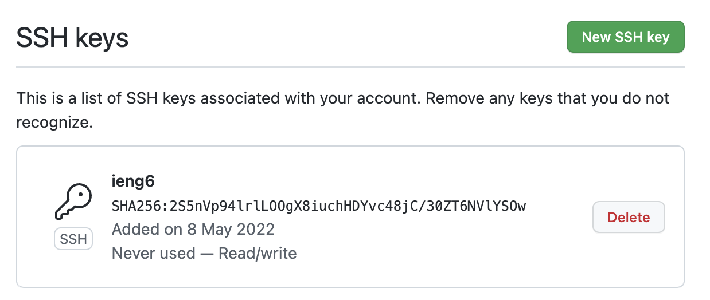
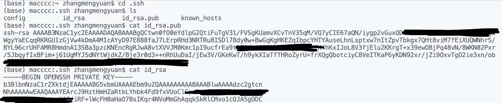
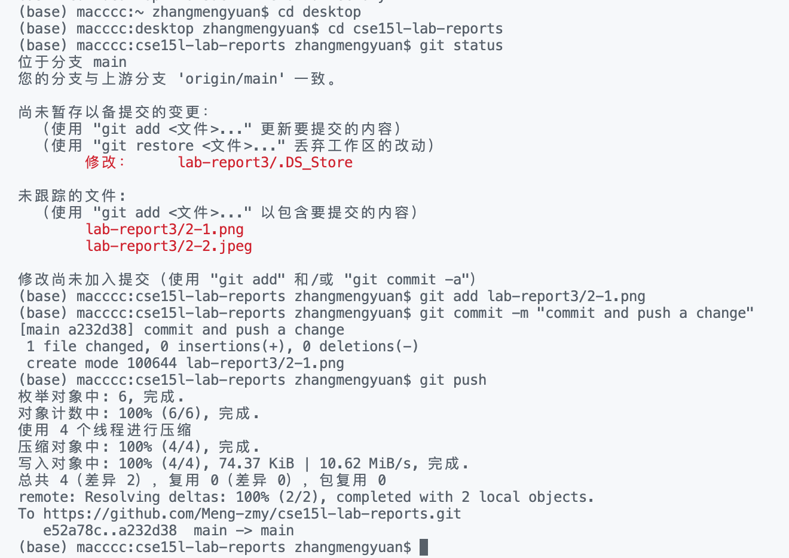
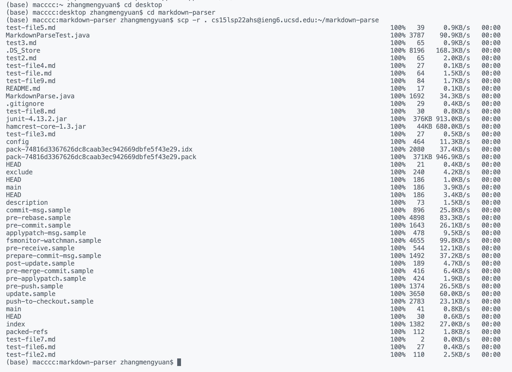
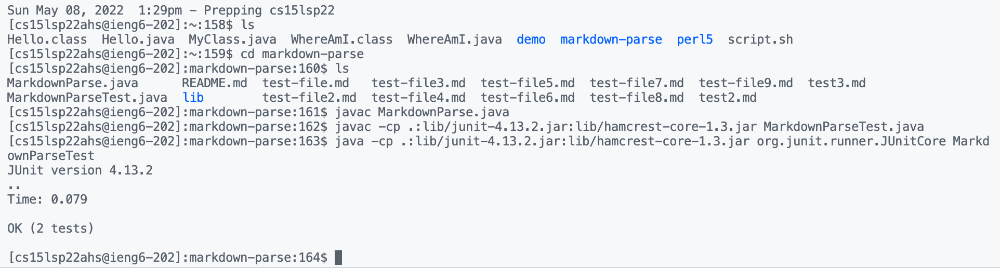
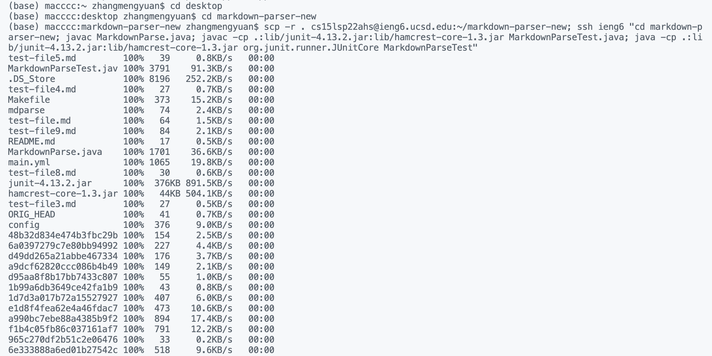
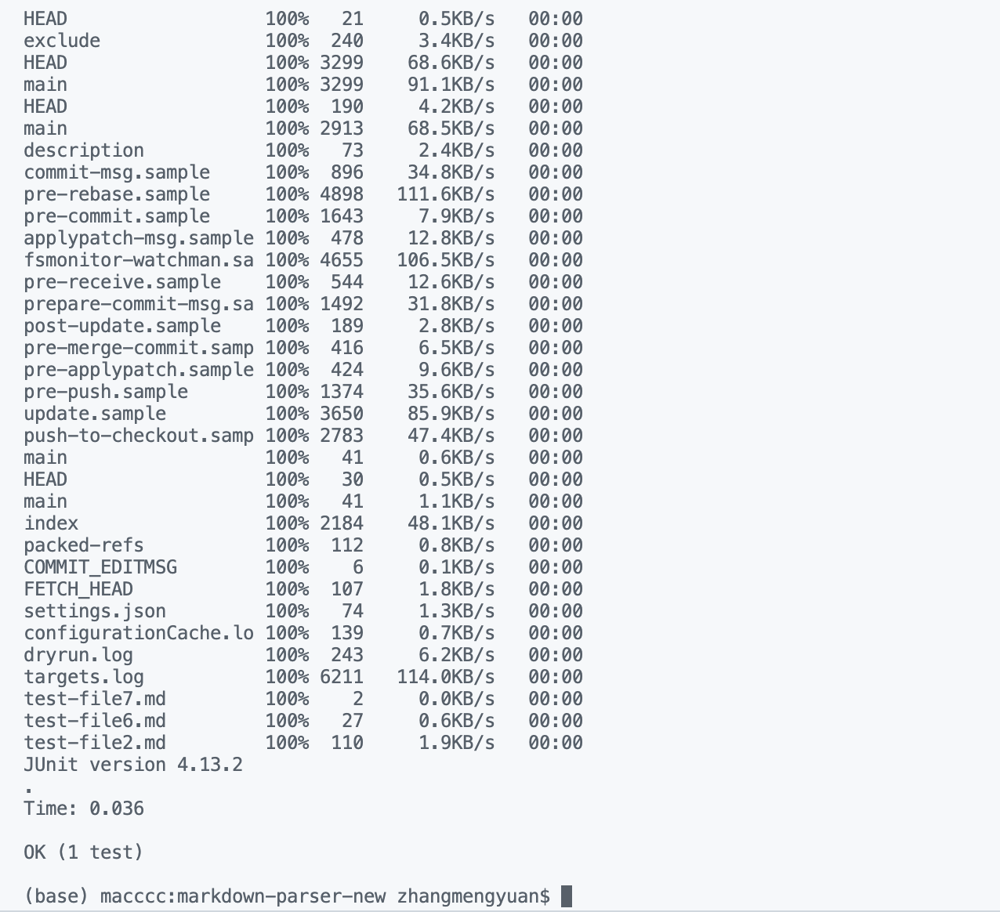

# Lab Report 3

## 1. Streamlining ssh Configuration

#### a. Create `.ssh/config` file
- On your terminal, using `cd .ssh` and `ls` to check is there config on your computer. If it doesn't exist, then create it. 

- You can use `vi config` to create and edit the config file. You need to press `i` from the keyboard to get into insert mode. Then you can add these lines into config file. After that, press `esc` to exit insert mode. Then type `:w` to save, and `:q` to quit.

*You should add these lines into config.*
```
Host ieng6
    HostName ieng6.ucsd.edu
    User cs15lsp22zzz (use your username)
```


#### d. Log `ssh`
- Then you can try this command `ssh ieng6`, if you set up correctly, you don't need to enter the password.


*If it doesn't work, you need to edit your config file.*
```
Host ieng6
    HostName ieng6.ucsd.edu
    User cs15lsp22zzz (use your username)
    IdentityFile ~/.ssh/id_rsa
```


#### c. `scp` command
- Just use the `scp` command copying a file to your account using just the alias you chose.


*I just copy a **MyClass.java** to my server account.*


## 2. Setup Github Access from ieng6

#### a. Create the public key and private key
- You need to create a SSH key on your Github. Here is the SSH key I create on my Github.



- In order to create a SSH key on Github, you need to find the public key on your computer by using `cd ~/.ssh`. The public key is under `id_rsa.pub`, the private key is under `id_rsa`. You can use `cat` to look the keys.




#### b. Running git commands
- In order to push the change using commands, you need to go to correct directory first. Then using `git add` and `git commit` to commit the change. After that, using `git push` to push the change to the Github.




#### c. Resuling commit
- This is the [link](https://github.com/Meng-zmy/cse15l-lab-reports/commit/a232d38c2fa95b1e083a6bf61678a12636a4cb5a) for successful git push commit.


## 3. Copy whole directories with `scp -r`

#### a. Copy whole markdown-parse to ieng6 accunt
- You can use `scp` to copy the markdown-parse to the remote server.
```
scp -r . cs15lsp22(Your own username)@ieng6.ucsd.edu:~/markdown-parse
```



#### b. Compile and run tests on ieng6
- Then you can go to remote server to compile and run test.
```
javac -cp .:lib/junit-4.13.2.jar:lib/hamcrest-core-1.3.jar MarkdownParseTest.java
java -cp .:lib/junit-4.13.2.jar:lib/hamcrest-core-1.3.jar org.junit.runner.JUnitCore MarkdownParseTest
```



#### c. Do above steps in one line
- Here is the code I use to copy the markdown-parse to ieng6 account, then compile and run tests on ieng6 by using only one line code:
```
scp -r . cs15lsp22ahs@ieng6.ucsd.edu:~/markdown-parser-new; ssh ieng6 "cd markdown-parser-new; javac MarkdownParse.java; javac -cp .:lib/junit-4.13.2.jar:lib/hamcrest-core-1.3.jar MarkdownParseTest.java; java -cp .:lib/junit-4.13.2.jar:lib/hamcrest-core-1.3.jar org.junit.runner.JUnitCore MarkdownParseTest"
```



