# Lab Report 4

*Here is the some repos that will be used in this lab report. This is the [my MarkdownParse repo](https://github.com/Meng-zmy/markdown-parser-new.git) and this is [reviewed MarkdownParse repo](https://github.com/ima-quack/markdown-parser.git).*

## Snippet 1

- Here is the raw text for the snippet 1:

```
`[a link`](url.com)

[another link](`google.com)`

[`cod[e`](google.com)

[`code]`](ucsd.edu)
```

- The expected output of this snippet should be like: 

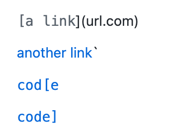

- Here is the test code I use in both my MarkdownParseTest and the reviewed MarkdownParseTest:
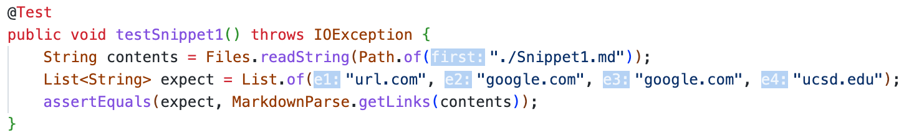

- The test result on my implementation: **Failed**
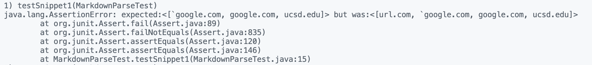
For my implementation, I do not check the character before the `[`. If I want to pass this test, I can add a if statement to check the character before the `[`, if there is ` ` `, then just do not add this link.

- The test result on reviewed implementation: **Failed**

For reviewed implementation, since there is `]` after a `]`, it does not go through the `ucsd.edu`. To solving this problem, it can be change to directly check there is `(` after the `]`.


## Snippet 2

- Here is the raw text for the snippet 2:

```
[a [nested link](a.com)](b.com)

[a nested parenthesized url](a.com(()))

[some escaped \[ brackets \]](example.com)
```

- The expected output of this snippet should be like:

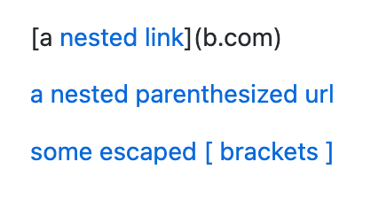

- Here is the test code I use in both my MarkdownParseTest and the reviewed MarkdownParseTest:
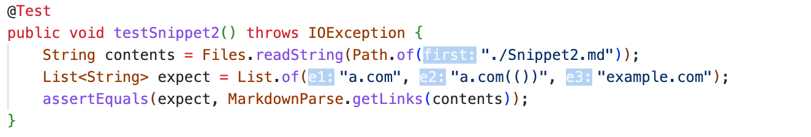

- The test result on my implementation: **Failed**
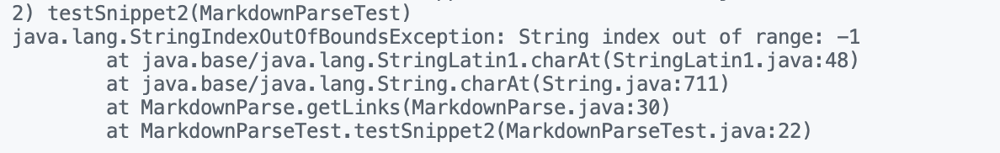

- The test result on reviewed implementation: **Failed**
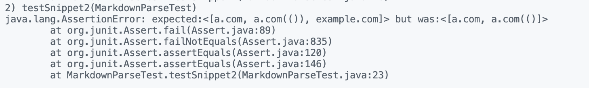


## Snippet 3

- Here is the raw text for the snippet 3:

```
[this title text is really long and takes up more than 
one line

and has some line breaks](
    https://www.twitter.com
)

[this title text is really long and takes up more than 
one line](
https://sites.google.com/eng.ucsd.edu/cse-15l-spring-2022/schedule
)


[this link doesn't have a closing parenthesis](github.com

And there's still some more text after that.

[this link doesn't have a closing parenthesis for a while](https://cse.ucsd.edu/


)

And then there's more text
```

- The expected output of this snippet should be like:

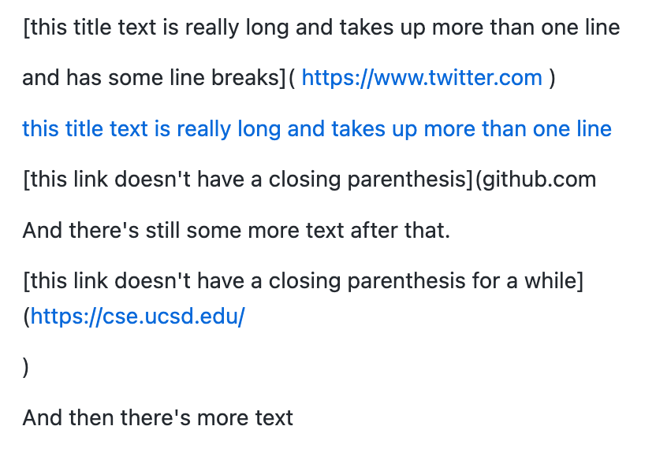

- Here is the test code I use in both my MarkdownParseTest and the reviewed MarkdownParseTest:
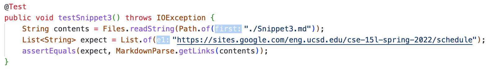

- The test result on my implementation: **Failed**
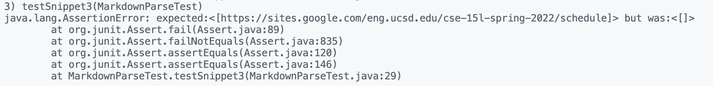

- The test result on reviewed implementation: **Failed**
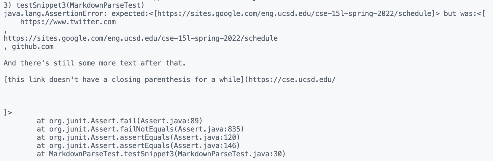