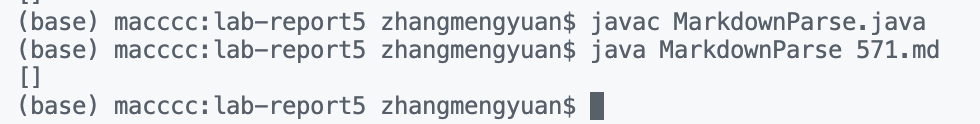

# Lab Report 5

## How I found the tests with different results

1. Run `bash script.sh > results.txt` on both repos. Then I will get two `results.txt`.

2. I can use `vimdiff my-markdown/results.txt markdown-parser/results.txt` to find the different between two result. The different part will be marked with color.

3. There is also another way to look the difference is to use `diff my-markdown/results.txt markdown-parser/results.txt`. But is method is hard for me to check which test file cause the difference.

## Test 1: test file `571.md`
- Here is the link for the test file: [click here](https://github.com/Meng-zmy/cse15l-lab-reports/blob/2f23085f32623ed34b4a9c87279efd29a9c77925/lab-report5/571.md)

- By looking at the preview of the `571.md`, the expected output should be `[]`.

- The implementation of professor provide is correct; the implementation of my code is incorrect.

- To solve this problem, I just need to creat a new if statement to check if there is `!` before the `[`. If there is `!` means it does not satify the format of the link, then do not add it into `toReturn`.

- *Here is the code I change:*

## Test 2: test file `367.md`
- Here is the link for the test file: [click here](https://github.com/Meng-zmy/cse15l-lab-reports/blob/fd0dd480b79762904fe17c550d6439a1718b8d3e/lab-report5/367.md)

- By looking at the preview of the `367.md`, the expected output should be `[]`.

- The implementation of professor provide is correct; the implementation of my code is incorrect.

- To solve this problem, I just need to check if there is any `[]` before the `()`. If there is no `[]` before the `()`, the just skip this things.

- *Here is the code I change:*

