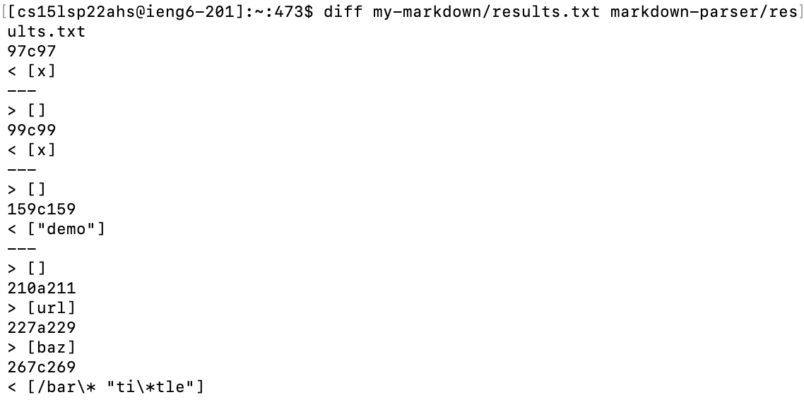

# Lab Report 5

## How I found the tests with different results

1. Run `bash script.sh > results.txt` on both repos. Then I will get two `results.txt`.

2. I can use `vimdiff my-markdown/results.txt markdown-parser/results.txt` to find the different between two result. The different part will be marked with color.

3. There is also another way to look the difference is to use `diff my-markdown/results.txt markdown-parser/results.txt`. But is method is hard for me to check which test file cause the difference.

## Test 1

## Test 2

